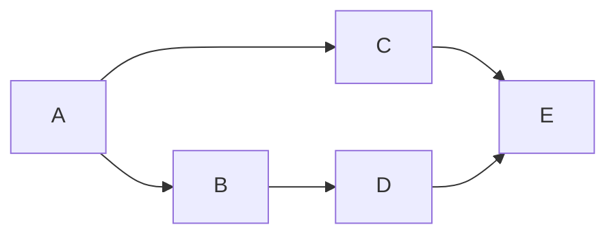

# Ordr

Ordr is a library that helps you execute and keep track of a set of interdependent functions.

It can create a graph (specifically a `DAG`) of functions depending on functions, and execute them as they get ready, in parallel.

Here is a simple example taken from one of the examples ([chatty](./ordr/examples/chatty.rs)) in the repo:



`E` is our target, and it depends `C` and `D` and so forth. Ordr will thus start executing `A`,
when that's done, it will execute `B` and `C` in parallel with the output of `A`, once `B` is done,
it'll start `D` (with the output of `B`) and when ready, `E` will be executed.

If any of the tasks return an error, the running tasks will be aborted and the execution stops and
a partial output will be returned.

A job (such as the above) can also be started with already existing data. Say in the above `C`
fails after `B` and `D` have completed successfully, we can then run it again with the `A`, `B`,
and `D` data, which will result in only `C` and then `E` being run.

The letters in the graph, we call nodes. In Rust code, they can be any struct, and they are the
output of an "producer": an `async` function that takes a "context", any number of other nodes,
and returns a `Result<A, ordr::Error>`. The context, is anything you want as long as it implements
`Clone`. It's meant to be used for having database connections or whatever else you need.

It looks like this:

```rs
#[derive(Clone)]
struct Ctx {
  // Whatever we need
}

// Our node `A`.
#[derive(Clone, Serialize, Deserialize)]
struct A(i32);

#[producer]
async fn my_a_producer(ctx: Ctx) -> Result<A, Infallible> {
    // Do some actual work
    Ok(A(123))
}
```

If we then have a node `B` that depends on `A`, we just add it to the arguments:

```rs
#[derive(Clone, Serialize, Deserialize)]
struct B(i32);

#[producer]
async fn make_b(ctx: Ctx, a: A) -> Result<B, Infallible> {
    Ok(B(a.0 + 2))
}
```

To execute everything, we first need to create a job.

```rs
let job = ordr::Job::builder()
    .add::<B>() // Adds `B` and its dependencies recursively
    .build()    // Checks for cycles and name collisions
    .unwrap();

// We also need the Context. If your tasks don't need a context, just use `()`.
let ctx = Ctx {};

// Next we need a worker to run the job.
let mut worker = ordr::Worker::new(job, ctx);

// Start the worker.
worker.run();

// And get the output once it's done. The output is an enum that you can inspect. It will tell you
// if a node failed or if the whole job was cancelled, etc.
let output = worker.get_output().await;

// Next we can get the collected data/results out. It's a HashMap of name to serialized value.
let data = worker.data().await;

let a: A = serddata


let res_a = outputs.get::<A>();
assert_eq!(res_a, Some(&A(123)));

let res_b = outputs.get::<B>();
assert_eq!(res_b, Some(&B(125)));
```

A few things to keep in mind:

* All nodes and the context must implement `Clone` and Serde's `Serialize` and `Deserialize`.
* All producers must return a `ordr::Error`.
* All producers must be async and take `ordr::Context<T>` as the first parameter.

## Mermaid diagram

It might be useful to inspect a `Job` visually. You can get a graph like this:

```rs
let job = Job::new().with_target::<B>();
let mermaid = ordr::mermaid(&job);
println!("{mermaid}");
```

## Adding multiple targets to a job

A job can have multiple targets. If two nodes depend on the same third node, it will only be
executed once.

```rs
let job = Job::builder()
    .add::<A>()
    .add::<B>()
    .build()
    .unwrap();
```

## Adding input to a job

If you aleady have results from earlier, or maybe cached somewhere, then you
can add it to the job, and the graph will not run the producers for them (nor
its dependencies).

```rs
// Worker from a previous job:
let data = worker.data().await;

// Creating a new job with this data.
let job = Job::builder_with_data(data).add::<B>().build().unwrap();
```

## Cancelling a job

You can get a cancellation token out of a job, that you can then later cancel.

This is useful for something like timeouts.

```rs
let mut worker = Worker::new(job, ctx);

// Starts the worker
worker.run();

// Stops it and cancels all running nodes.
worker.stop();

// You can still get the ouput.
let output = worker.get_output().await;

// And whatever data was done before you stopped it.
let data = worker.data().await;
```


# Contributing

You are of course welcome to contribute. I don't expect to spend much time on this going forward,
but I'm generally open for suggestions or pull requests.

Tests can be run with these two commands:

```sh
cargo test
cargo test --examples
```

I personally use the examples to play around or to test a specific feature.
